# Voxie — Enterprise AI Voice Agent Platform

**Voxie** is an advanced, production-ready multi-agent voice AI platform that empowers businesses to dynamically create, manage, and deploy custom voice agents. By leveraging cutting-edge LLMs and real-time WebRTC infrastructure, Voxie allows organizations to scale customer-facing operations instantly with intelligent, low-latency conversational AI.

## 🌟 The Value Proposition: Why Use Voxie?

Building scalable, real-time voice AI requires solving complex challenges across low-latency audio streaming, LLM orchestration, state management, and real-time backend integrations. Voxie delivers a **turnkey, enterprise-grade architecture** that solves these infrastructural bottlenecks out of the box.

### **The Problem It Solves**

Traditional IVR (Interactive Voice Response) systems are rigid, frustrating for users, and expensive to maintain. Building modern AI voice agents from scratch is equally painful, often suffering from high latency (awkward pauses), lack of persistence, and difficult integration into existing business tools.

### **The Voxie Solution & Benefits**

- **Dynamic Creation:** A meta-agent (the "Voxie" agent) guides users to create _new_ sub-agents conversationally. No coding required to spawn new customer support, sales, or booking agents.
- **Ultra-Low Latency:** Built on WebRTC (LiveKit), bypassing traditional HTTP bottlenecks, ensuring human-like conversation pace without awkward silences.
- **Immediate ROI:** Deflect up to 80% of routine customer calls (support, booking, lead qualification) to AI, freeing human agents for high-value tasks.
- **Data-Driven Insights:** Every conversation is transcribed, analyzed, and summarized by AI, providing instant visibility into call sentiment, resolution rates, and API costs right in the provided dashboard.
- **Enterprise-Ready:** Complete observability through SSE log streaming, granular PostgreSQL (Supabase) tracking, and structured REST APIs.

---

## 🏗️ Technical Expertise & Architecture

This repository demonstrates **Senior-Level Engineering Expertise** across multiple domains:

1. **High-Performance Asynchronous Python:** Heavy use of `asyncio`, FastAPI, and internal Event Buses to handle concurrent real-time audio streams without blocking the event loop.
2. **Advanced AI Orchestration:** Integrates the **OpenAI Realtime API** with tools/function calling, enabling the AI to query databases and invoke RAG (Retrieval-Augmented Generation) pipelines mid-conversation.
3. **WebRTC & Audio Engineering:** Seamlessly interfaces with LiveKit Cloud for robust audio handling, using Deepgram for speech-to-text (STT) and Cartesia for ultra-realistic text-to-speech (TTS).
4. **Cloud-Native Infrastructure:** A decoupled, deployable architecture designed for horizontal scaling on platforms like Railway, AWS, or GCP.

```mermaid
graph TD;
    User[📱 Client/Browser] -->|WebRTC Audio| LiveKit[☁️ LiveKit Cloud]
    User -->|HTTPS| Backend[⚡ FastAPI Backend]

    LiveKit <-->|Audio Stream| Agents[🤖 Voxie Python Agents]
    Agents <-->|Realtime API| OpenAI[🧠 OpenAI GPT-4o]
    Agents <-->|RAG queries| Ragie[📚 Ragie Knowledge DB]

    Backend <-->|CRUD & Analytics| DB[(Supabase PostgreSQL)]
    Agents -->|Transcripts & State| DB

    classDef infra fill:#f9f,stroke:#333,stroke-width:2px;
    class LiveKit,OpenAI,Ragie,DB infra;
```



## 🚀 Key Technical Features

- **Conversational Meta-Agent Builder** — Dynamically generate agent configurations purely through voice conversation.
- **Real-Time Voice Calls** — Sub-second latency WebRTC audio transmission.
- **Agent Persistence & State Management** — Full lifecycle tracking via Supabase.
- **Automated Call Analytics** — Post-call processing that tracks tokens used, transcribes audio, calculates cost, and classifies business outcomes.
- **RAG Integration** — Seamless injection of company knowledge bases via Ragie.
- **SSE Log Streaming** — Event bus architecture broadcasting real-time agent creation logs to the frontend via Server-Sent Events.

## 🛠️ Tech Stack

| Domain                     | Technology                              |
| -------------------------- | --------------------------------------- |
| **Backend & API**          | Python 3.11+, FastAPI, Uvicorn, asyncio |
| **Voice Infrastructure**   | LiveKit Cloud (WebRTC)                  |
| **AI / NLP**               | OpenAI GPT-4o & Realtime API            |
| **Speech Processing**      | Deepgram (STT), Cartesia (TTS)          |
| **Database & Persistence** | Supabase (PostgreSQL)                   |
| **Knowledge Base (RAG)**   | Ragie                                   |
| **Agent Framework**        | LiveKit Agents SDK                      |

---

## Prerequisites

Before you start, create accounts and get API keys from:

| Service                   | What You Need              | Sign Up                                            |
| ------------------------- | -------------------------- | -------------------------------------------------- |
| **OpenAI**                | API key (`sk-proj-...`)    | [platform.openai.com](https://platform.openai.com) |
| **LiveKit Cloud**         | API key, secret, and URL   | [livekit.io](https://livekit.io)                   |
| **Supabase**              | Project URL and anon key   | [supabase.com](https://supabase.com)               |
| **Deepgram** _(optional)_ | API key for transcription  | [deepgram.com](https://deepgram.com)               |
| **Ragie** _(optional)_    | API key for knowledge base | [ragie.ai](https://ragie.ai)                       |

**Local tools:**

- **Python 3.11+** — [python.org](https://www.python.org/downloads/)
- **uv** (fast Python package manager) — `curl -LsSf https://astral.sh/uv/install.sh | sh`
- **Git**

---

## Setup

### 1. Clone the Repository

```bash
git clone <your-repo-url>
cd voxie
```

### 2. Create Environment File

Copy the example and fill in your credentials:

```bash
cp .env.example .env.local
```

Edit `.env.local` with your actual values:

```bash
# LiveKit Configuration
LIVEKIT_URL=wss://your-project.livekit.cloud
LIVEKIT_API_KEY=your-api-key
LIVEKIT_API_SECRET=your-api-secret

# Supabase Configuration
SUPABASE_URL=https://your-project.supabase.co
SUPABASE_ANON_KEY=your-supabase-anon-key

# API Keys
OPENAI_API_KEY=sk-proj-your-openai-key
DEEPGRAM_API_KEY=your-deepgram-key          # optional
RAGIE_API_KEY=your-ragie-key                # optional
ANTHROPIC_API_KEY=sk-ant-your-anthropic-key # optional

# Backend Configuration
BACKEND_URL=http://localhost:8000
ENABLE_BACKEND_LOGGING=true
```

> **Note:** The backend loads `.env.local` first, then falls back to `.env`, then system env vars.

### 3. Set Up Supabase Database

Run these SQL commands in your Supabase dashboard → SQL Editor:

```sql
-- Agents table (stores agent configurations)
CREATE TABLE agents (
    id UUID PRIMARY KEY DEFAULT uuid_generate_v4(),
    user_requirements JSONB NOT NULL,
    processed_spec JSONB NOT NULL,
    session_id TEXT,
    room_id TEXT,
    created_at TIMESTAMPTZ DEFAULT NOW(),
    updated_at TIMESTAMPTZ DEFAULT NOW()
);

-- Call sessions table (tracks all voice calls)
CREATE TABLE call_sessions (
    id UUID PRIMARY KEY DEFAULT uuid_generate_v4(),
    session_id TEXT NOT NULL,
    agent_id UUID REFERENCES agents(id),
    room_name TEXT NOT NULL,
    primary_agent_type TEXT,
    customer_name TEXT,
    customer_phone TEXT,
    started_at TIMESTAMPTZ DEFAULT NOW(),
    ended_at TIMESTAMPTZ,
    call_status TEXT DEFAULT 'active',
    call_rating INTEGER,
    customer_sentiment TEXT,
    issue_resolved BOOLEAN,
    notes TEXT
);

-- Conversation turns table (tracks dialogue)
CREATE TABLE conversation_turns (
    id UUID PRIMARY KEY DEFAULT uuid_generate_v4(),
    call_session_id UUID REFERENCES call_sessions(id),
    turn_number INTEGER NOT NULL,
    speaker TEXT NOT NULL,
    transcript TEXT NOT NULL,
    agent_name TEXT,
    function_called TEXT,
    timestamp TIMESTAMPTZ DEFAULT NOW()
);

-- Token usage table (tracks API costs)
CREATE TABLE token_usage (
    id UUID PRIMARY KEY DEFAULT uuid_generate_v4(),
    call_session_id UUID REFERENCES call_sessions(id),
    model_name TEXT NOT NULL,
    input_tokens INTEGER DEFAULT 0,
    output_tokens INTEGER DEFAULT 0,
    total_tokens INTEGER DEFAULT 0,
    cost_per_input_token NUMERIC(10, 8),
    cost_per_output_token NUMERIC(10, 8),
    total_cost_usd NUMERIC(10, 4),
    timestamp TIMESTAMPTZ DEFAULT NOW()
);

-- Call summaries table (AI-generated call summaries)
CREATE TABLE call_summaries (
    id UUID PRIMARY KEY DEFAULT uuid_generate_v4(),
    call_session_id UUID REFERENCES call_sessions(id) UNIQUE,
    summary_text TEXT NOT NULL,
    key_points TEXT[],
    action_items TEXT[],
    call_category TEXT,
    business_outcome TEXT,
    sales_value_usd NUMERIC(10, 2),
    generated_by TEXT DEFAULT 'gpt-4o',
    tokens_used INTEGER,
    generated_at TIMESTAMPTZ DEFAULT NOW()
);

-- Indexes for performance
CREATE INDEX idx_call_sessions_agent_id ON call_sessions(agent_id);
CREATE INDEX idx_call_sessions_started_at ON call_sessions(started_at);
CREATE INDEX idx_conversation_turns_call_session_id ON conversation_turns(call_session_id);
CREATE INDEX idx_token_usage_call_session_id ON token_usage(call_session_id);
CREATE INDEX idx_call_summaries_call_session_id ON call_summaries(call_session_id);
```

### 4. Install Dependencies

The project has two separate Python environments:

```bash
# 1. Root — Backend API dependencies
pip install -r requirements.txt

# 2. voxie-test — Agent runtime dependencies (managed by uv)
cd voxie-test
uv sync
cd ..
```

---

## Running Locally

### Start the Backend API Server

```bash
python backend_server.py
# → Server runs on http://localhost:8000
```

### Start the Voice Agent (Voxie)

In a separate terminal:

```bash
cd voxie-test
uv run python src/agent.py dev
```

This starts Voxie in dev mode — it auto-joins any new LiveKit room. When a user connects, Voxie guides them through creating a custom voice agent.

### Start a Specific Agent by ID

```bash
export AGENT_ID="your-agent-uuid"
cd voxie-test
uv run python src/agent.py dev
```

### Test via Browser

1. Open `http://localhost:8000/call` for the voice call interface
2. Open `http://localhost:8000/dashboard` for the agent dashboard
3. Or open `simple_call_interface.html` directly in your browser

---

## API Reference

All endpoints run on `http://localhost:8000`:

### Health & Dashboard

| Method | Endpoint     | Description                     |
| ------ | ------------ | ------------------------------- |
| `GET`  | `/`          | Health check                    |
| `GET`  | `/dashboard` | Serves the agent dashboard UI   |
| `GET`  | `/call`      | Serves the voice call interface |

### Agent CRUD

| Method   | Endpoint             | Description                       |
| -------- | -------------------- | --------------------------------- |
| `GET`    | `/api/agents`        | List all agents                   |
| `GET`    | `/api/agents/{id}`   | Get agent by ID                   |
| `PUT`    | `/api/agents/{id}`   | Update agent (partial)            |
| `DELETE` | `/api/agents/{id}`   | Delete agent                      |
| `POST`   | `/api/agents/create` | Create agent (returns session_id) |

### Voice Calls

| Method | Endpoint          | Description                                       |
| ------ | ----------------- | ------------------------------------------------- |
| `POST` | `/api/call/start` | Start a call (creates LiveKit room, spawns agent) |
| `POST` | `/api/call/end`   | End a call session                                |

### Analytics

| Method | Endpoint                      | Description                        |
| ------ | ----------------------------- | ---------------------------------- |
| `GET`  | `/api/analytics/summary`      | Today's call stats, costs, ratings |
| `GET`  | `/api/analytics/recent-calls` | Recent call history                |

### SSE Streaming

| Method | Endpoint                                 | Description                         |
| ------ | ---------------------------------------- | ----------------------------------- |
| `GET`  | `/api/agents/create-stream/{session_id}` | Real-time agent creation logs (SSE) |

---

## Project Structure

```
voxie/
├── backend_server.py              # FastAPI backend API server
├── simple_agent.py                # Production agent runner (single process)
├── backend_log_handler.py         # Real-time log streaming helper
├── event_logger.py                # Event logging utility
│
├── voxie-test/                    # Voice agent runtime
│   ├── src/
│   │   ├── agent.py               # Main multi-agent system (Voxie)
│   │   ├── agent_persistence.py   # Agent save/load from DB
│   │   ├── call_analytics.py      # Call tracking & analytics
│   │   ├── call_records_manager.py # Call record management
│   │   ├── transcription_handler.py # Transcription & summarization
│   │   ├── knowledge_base_tools.py # Knowledge base integration
│   │   ├── analytics_dashboard.py # Analytics dashboard logic
│   │   ├── supabase_client.py     # Supabase DB client
│   │   ├── ragie_db_tool.py       # Ragie RAG integration
│   │   └── ragie_voice_agent.py   # RAG-enabled voice agent
│   ├── pyproject.toml             # Agent dependencies (uv)
│   └── Dockerfile                 # Agent container for deployment
│
├── function_call/                 # Shared utilities
│   ├── supabase_client.py         # Supabase client (used by backend)
│   ├── agent_persistence.py       # Agent CRUD operations
│   ├── ragie_db_tool.py           # Ragie RAG tool
│   ├── ragie_voice_agent.py       # RAG voice agent
│   ├── voice_agent_function.py    # Voice agent function tools
│   ├── voice_agent_hybrid.py      # Hybrid voice agent
│   └── webhook_server.py          # Webhook server
│
├── agent_dashboard.html           # Agent management dashboard
├── simple_call_interface.html     # Browser voice call interface
├── simple_call_interface_cloud.html # Cloud-configured call interface
├── frontend_demo.html             # SSE log viewer demo
│
├── .env.example                   # Environment variable template
├── requirements.txt               # Backend Python dependencies
├── requirements-backend.txt       # Backend-only minimal deps
├── Procfile                       # Railway start command
├── railway.toml                   # Railway deployment config
└── runtime.txt                    # Python version for deployment
```

---

## Deployment (Railway)

### 1. Push to GitHub

```bash
git add .
git commit -m "Ready for deployment"
git push origin main
```

### 2. Deploy on Railway

1. Go to [railway.app](https://railway.app) → **New Project** → **Deploy from GitHub Repo**
2. Select your repository
3. Railway auto-detects Python (via `requirements.txt`) and deploys

### 3. Set Environment Variables

In Railway dashboard → your service → **Variables** tab, add all keys from `.env.example`:

- `SUPABASE_URL`, `SUPABASE_ANON_KEY`
- `LIVEKIT_URL`, `LIVEKIT_API_KEY`, `LIVEKIT_API_SECRET`
- `OPENAI_API_KEY`

Click **Deploy** to restart with the new variables.

### 4. Test

```bash
curl https://your-app.railway.app/
curl https://your-app.railway.app/api/agents
```

### Agent Deployment

The voice agent (`voxie-test/`) runs separately from the backend. Deploy it to a compute instance (AWS EC2, GCP, etc.) or use the included `Dockerfile` in `voxie-test/`:

```bash
cd voxie-test
docker build -t voxie-agent .
docker run --env-file ../.env.local voxie-agent
```

---

## Troubleshooting

| Problem                               | Solution                                                                           |
| ------------------------------------- | ---------------------------------------------------------------------------------- |
| **Agent not connecting to LiveKit**   | Verify `LIVEKIT_URL`, `LIVEKIT_API_KEY`, and `LIVEKIT_API_SECRET` in `.env.local`  |
| **Supabase connection fails**         | Check `SUPABASE_URL` and `SUPABASE_ANON_KEY`; verify tables exist                  |
| **"Could not import backend_server"** | Make sure you're running from the `voxie/` root, not `voxie-test/`                 |
| **Port 8000 already in use**          | Kill the existing process: `kill $(lsof -ti:8000)`                                 |
| **Missing Python packages**           | Run `pip install -r requirements.txt` (root) and `uv sync` (in `voxie-test/`)      |
| **Call summaries not generating**     | Summaries only generate for calls > 3 minutes; verify OpenAI key has GPT-4o access |

---

## Acknowledgments

- [LiveKit](https://livekit.io) — Real-time voice infrastructure
- [OpenAI](https://openai.com) — GPT-4o for agent intelligence and summaries
- [Supabase](https://supabase.com) — Database and backend services
- [Deepgram](https://deepgram.com) — Speech-to-text transcription
- [Cartesia](https://cartesia.ai) — Text-to-speech
- [Ragie](https://ragie.ai) — RAG knowledge base
